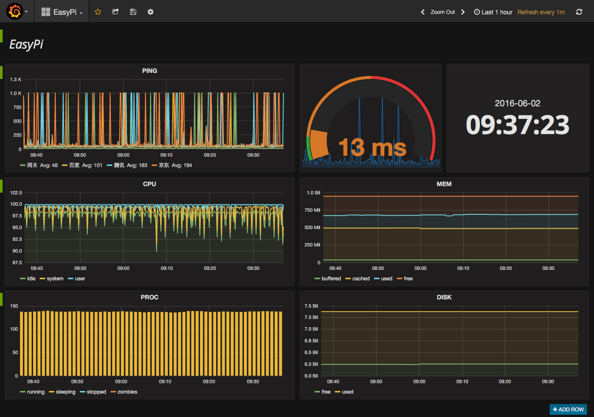

docker-dashboard-arm
====================

:bar_chart: Dashboard with Docker Containers on RaspberryPi

### How It Works

- [easypi/telegraf-arm][1] - Collect data
- [easypi/influxdb-arm][2] - Store data
- [easypi/grafana-arm][3] - Show data

### Quickstart

```bash
$ git clone https://github.com/EasyPi/docker-dashboard-arm.git
$ cd docker-dashboard-arm/fig/
$ tree -F
.
├── grafana/
│   └── docker-compose.yml
├── influxdb/
│   └── docker-compose.yml
└── telegraf/
    └── docker-compose.yml

$ cd influxdb/
$ docker-compose up -d

$ cd ../telegraf/
$ docker-compose run --rm telegraf -sample-config > telegraf.conf
$ vim telegraf.conf
$ docker-compose up -d

$ cd ../grafana/
$ docker-compose up -d
```

### Screenshot



[1]: https://hub.docker.com/r/easypi/telegraf-arm/
[2]: https://hub.docker.com/r/easypi/influxdb-arm/
[3]: https://hub.docker.com/r/easypi/grafana-arm/
